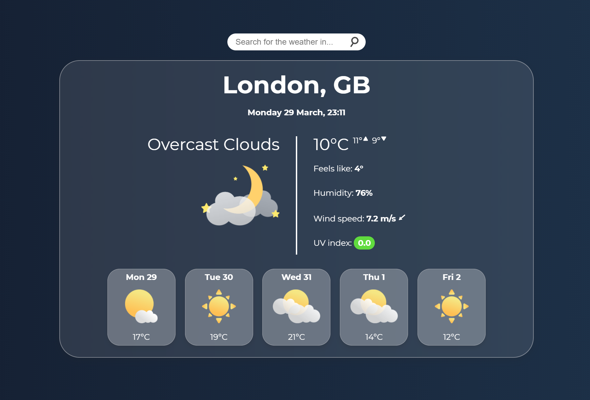
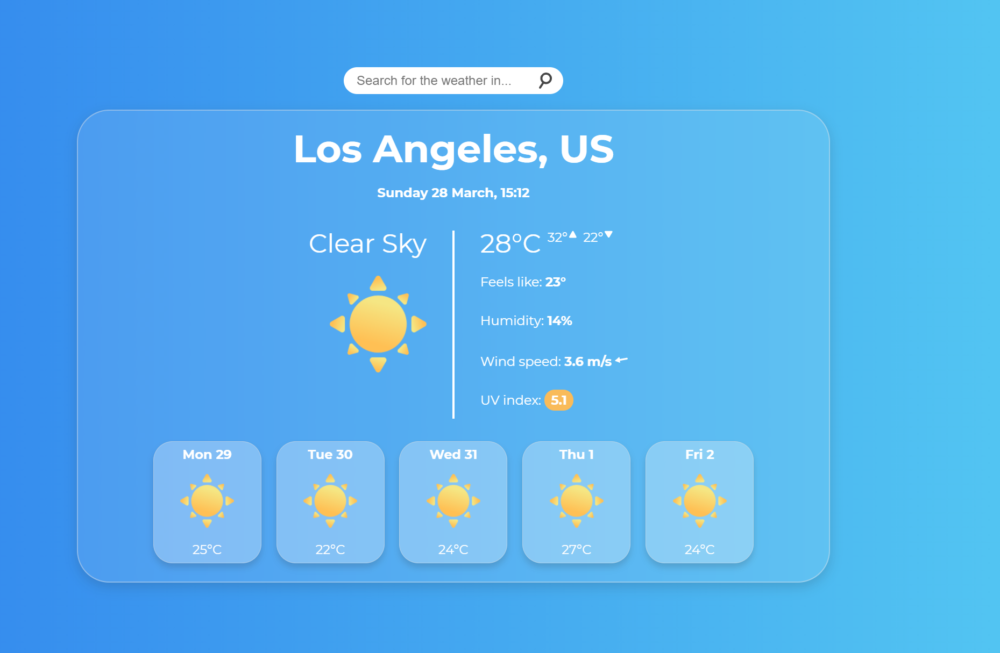
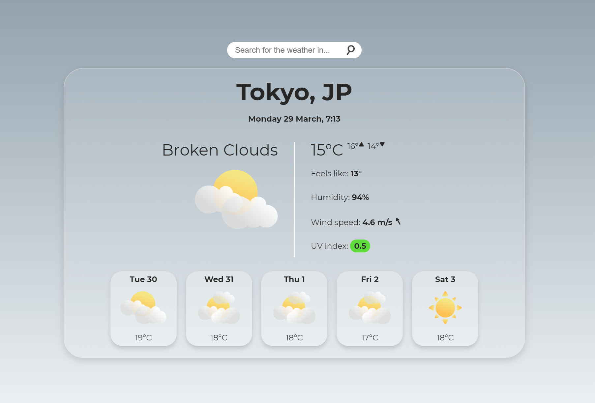

# Weather App

Remember that time you went out and it started raining and you got drenched because you didn't have an umbrella? No? That's right, because you're smart. And smart people use weather apps, like this one.

There are a lot of things I wish I had the time to implement, such as a popup of previous location searches and animations for the weather and search bar. 

I had a lot frustrating issues, most of the time they were small and easy to fix. One example of an issue I wasn't able to address properly was the time (and consequently date) displayed. The clocks went forward recently and the time was showing as one hour ahead. I have used a really hacky method to display it correctly(i.e a plaster fix).

I intended to animate the weather icons, but again due to lack of time I wasn't able to. I may come back and add some more polish to this app or even redesign it from the ground up, as I did really enjoy making it.

## The finished product

[Link to site](https://bytemybits.github.io/weather-app/)

